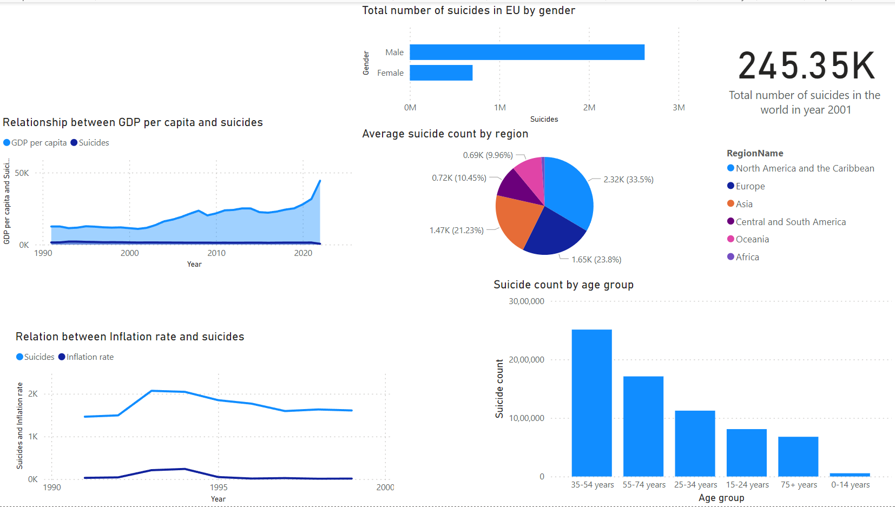
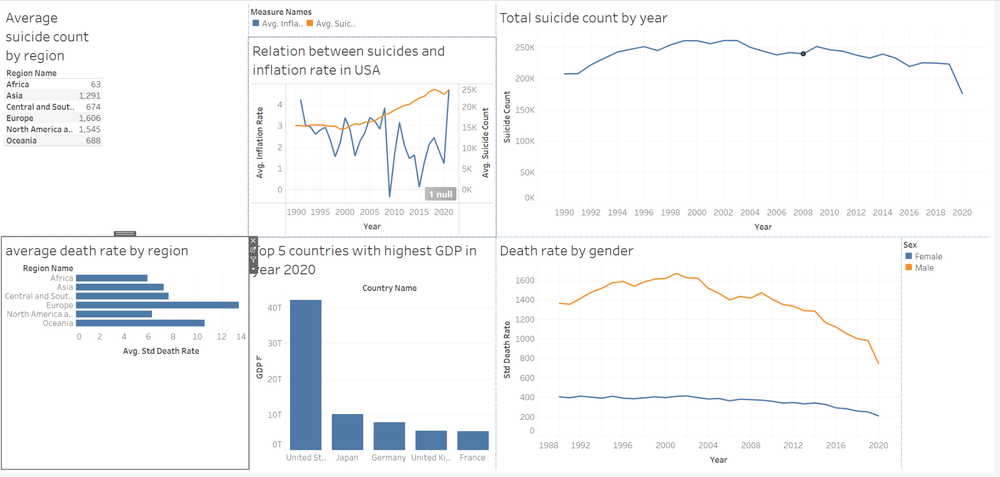

# Suicide Rates & Socioeconomic Analysis

A data analytics project exploring global suicide rates and socioeconomic indicators using multiple ETL, analytics, machine learning, and visualization technologies.

## Architecture

```text
                  CSV Datasets
                       │
             ┌─────────┴─────────┐
             │                   │
      Python / Pandas           SSIS
           ETL                   ETL
             │                   │
             └─────────┬─────────┘
                       │
                  SQL Server
                       │
               Data Analysis
                       │
          ┌────────────┴────────────┐
          │                         │
       Power BI                  Tableau
       Dashboard                 Dashboard
```

Python was also used for exploratory predictive modeling and anomaly detection using **Scikit-learn and TensorFlow**.

## Tech Stack

**Python • Pandas • SSIS • SQL Server • Scikit-learn • TensorFlow • Power BI • Tableau**

## Power BI Dashboard



## Tableau Dashboard



## Project Components

- **Pandas ETL:** `etl/python/pandas_etl.ipynb`
- **SSIS ETL:** `etl/ssis/`
- **SQL Analysis:** `sql/suicide_analysis.sql`
- **Predictive & Anomaly Analysis:** `analysis/notebooks/predictive_analysis.ipynb`
- **Power BI:** `dashboards/powerbi/`
- **Tableau:** `dashboards/tableau/`

## Summary

This project demonstrates data cleaning and transformation using both **Pandas and SSIS**, analytical querying with **SQL Server**, exploratory machine learning and anomaly detection with **Python**, and data visualization using both **Power BI and Tableau**.